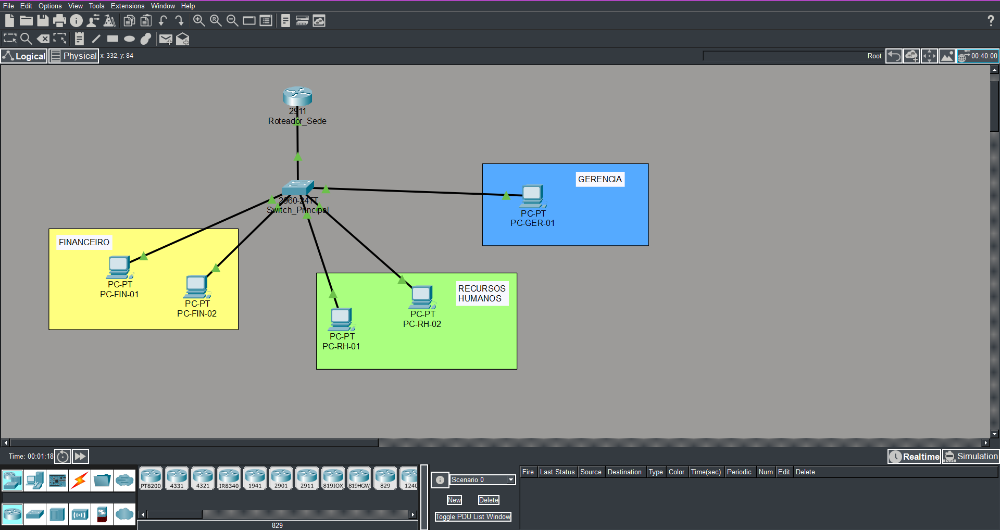

# Projeto de Rede Corporativa: Segmentação e Gerência Segura

Este laboratório demonstra a implementação de uma rede segmentada por departamentos utilizando a topologia **Router-on-a-Stick** e boas práticas de segurança Cisco.

## 📍 Topologia

## 🛠️ Tecnologias e Protocolos
- **VLANs:** Segmentação de tráfego (VLAN 10: Fin, VLAN 20: RH).
- **Gerência (VLAN 99):** Rede isolada para administração dos ativos.
- **Trunking (802.1Q):** Transporte de múltiplas redes em um único link físico.
- **SSH v2:** Acesso remoto criptografado (substituindo o Telnet).
- **Hardening:** Portas não utilizadas foram desativadas (Shutdown).

## 🔑 Credenciais de Acesso (Laboratório)
- **Usuário:** admin
- **Senha:** [packet2026]
- **Enable Secret:** [cisco2026]

## 🚀 Como testar
1. Baixe o arquivo `.pkt` deste repositório.
2. No Packet Tracer, realize pings entre os PCs para validar o roteamento.
3. Acesse o Switch via SSH através do terminal de qualquer PC: `ssh -l admin 192.168.99.2`.
